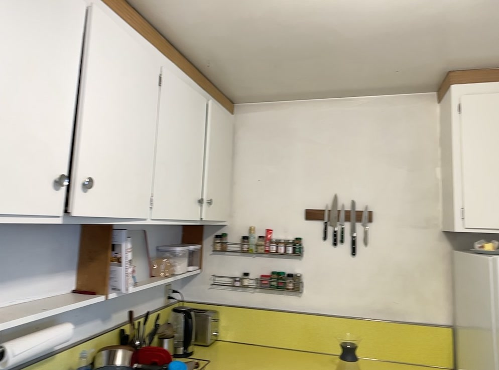
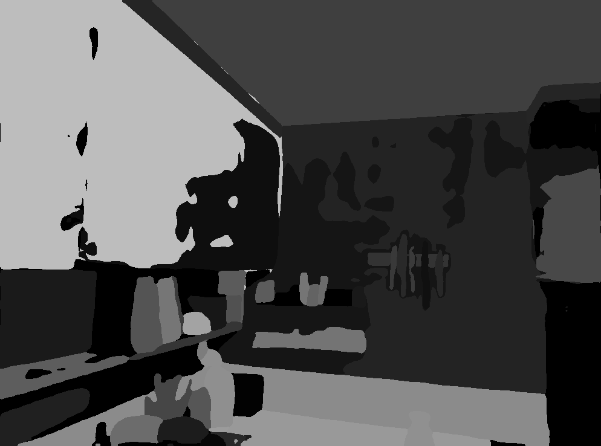

# Gaussian Grouping [ECCV'24]

> [**Gaussian Grouping: Segment and Edit Anything in 3D Scenes**](https://arxiv.org/abs/2312.00732)            
> [[项目页面]](https://ymq2017.github.io/gaussian-grouping)            
> ECCV 2024  
> ETH Zurich

## 安装

将仓库克隆到本地
```bash
git clone https://github.com/lkeab/gaussian-grouping.git 
cd gaussian-grouping
```

提供的默认安装方法基于 Conda 包和环境管理：
```bash
conda create -n gaussian_grouping python=3.8 -y
conda activate gaussian_grouping 

conda install pytorch==1.12.1 torchvision==0.13.1 torchaudio==0.12.1 cudatoolkit=11.3 -c pytorch
pip install plyfile==0.8.1
pip install tqdm scipy wandb opencv-python scikit-learn lpips

pip install submodules/diff-gaussian-rasterization
pip install submodules/simple-knn
```

（可选）如果需要在自己的数据集上准备掩模，还需要准备 [DEVA](https://github.com/hkchengrex/Tracking-Anything-with-DEVA) 环境。

```bash
cd Tracking-Anything-with-DEVA
pip install -e .
bash scripts/download_models.sh     # 下载预训练模型

git clone https://github.com/hkchengrex/Grounded-Segment-Anything.git 
cd Grounded-Segment-Anything
export AM_I_DOCKER=False
export BUILD_WITH_CUDA=True
python -m pip install -e segment_anything
python -m pip install -e GroundingDINO

cd ../..
```

（可选）如果需要在自己的数据集上进行修复，还需要准备 [LaMa](https://github.com/advimman/lama) 环境。

```bash
cd lama
pip install -r requirements.txt
cd ..
```

## 训练

### 1. 准备关联的 SAM 掩模

#### 1.1 预转换的数据集
提供了转换后的数据集，可以直接从 [hugging face 链接](https://huggingface.co/mqye/Gaussian-Grouping/tree/main) 使用数据集进行训练

```
data
|____bear
|____lerf
| |____figurines
|____mipnerf360
| |____counter
```

#### 1.2 （可选）准备自己的数据集
对于自定义数据集，可以按照以下步骤为训练创建掩模。如果需要在自己的数据集上准备掩模，将需要 [DEVA](../Tracking-Anything-with-DEVA/README.md) Python 环境和检查点。

```
<location>
|---input
    |---<image 0>
    |---<image 1>
    |---...
```

首先，使用 colmap 转换初始相机姿态和点云
```bash
python convert.py -s <location>
```

然后，转换 SAM 关联对象掩模。请注意，转换掩模的质量将极大地影响 3D 语义分割和编辑的结果。并且获取掩模非常快。因此，最好先调整 anything segment 的参数，使掩模从多个视图中看起来尽可能一致和合理。

示例1. Bear 数据集
```bash
bash script/prepare_pseudo_label.sh bear 1
```

示例2. Figurines 数据集
```bash
bash script/prepare_pseudo_label.sh lerf/figurines 1
```

示例3. Counter 数据集
```bash
bash script/prepare_pseudo_label.sh mipnerf360/counter 2
```

### 2. 训练和掩模渲染

对于 Gaussian Grouping 训练和训练好的 3D Gaussian Grouping 模型的分割渲染：

示例1. Bear 数据集
```bash
bash script/train.sh bear 1
```

示例2. Figurines 数据集
```bash
bash script/train_lerf.sh lerf/figurines 1
```

示例3. Counter 数据集
```bash
bash script/train.sh mipnerf360/counter 2
```


## 局限性

2D SAM 分割与 mask 的匹配会出现问题。

<center class="half">


</center>
